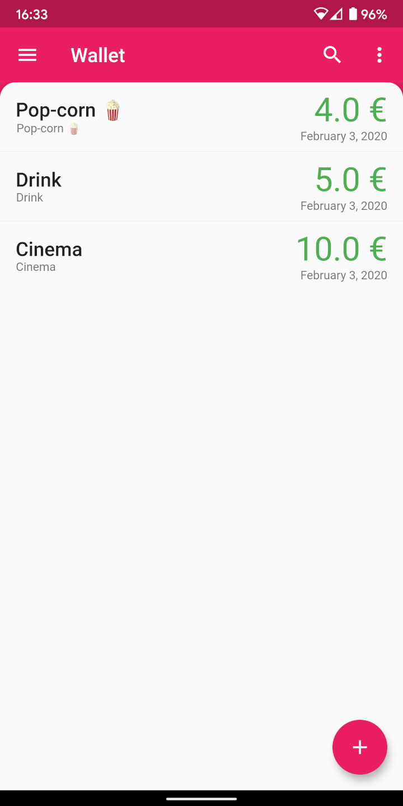
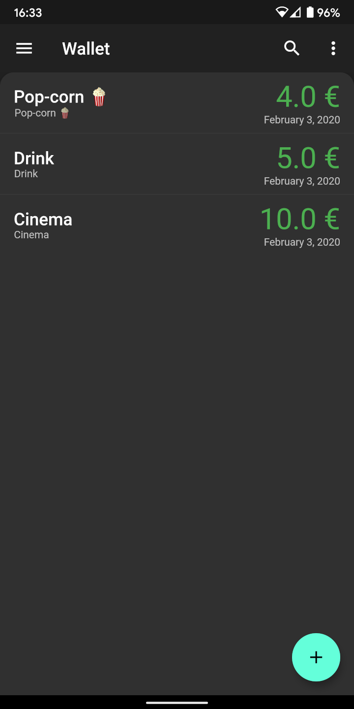
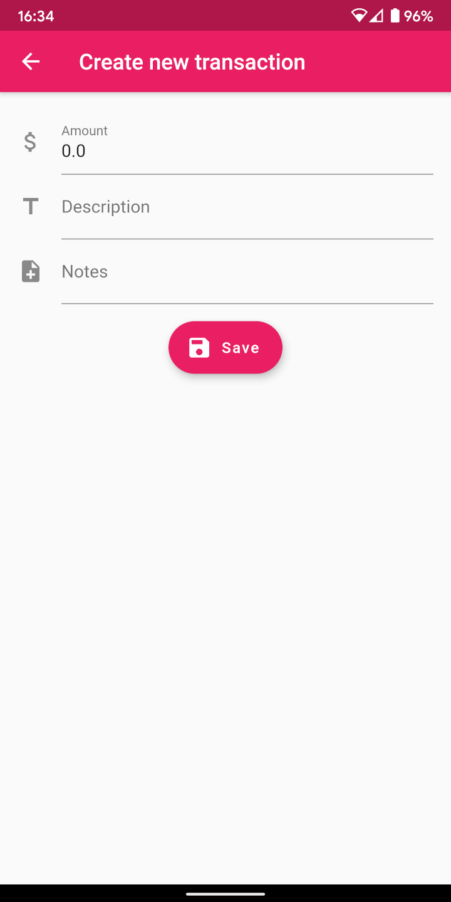

# FWallet

FWallet is an expense trucker built with [Flutter](https://flutter.dev/). Data is stored on [Firestore](https://firebase.google.com/docs/firestore).

To try out this app, you need to: 
* Add Firebase to the project following [these](https://firebase.google.com/docs/flutter/setup) instructions. 

## Screenshots
||||

## License
FWallet is licensed under [The MIT License (MIT)](LICENSE).